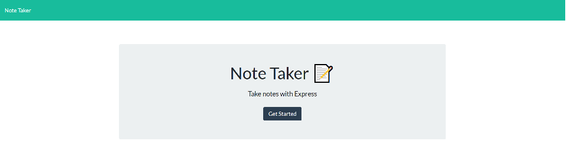
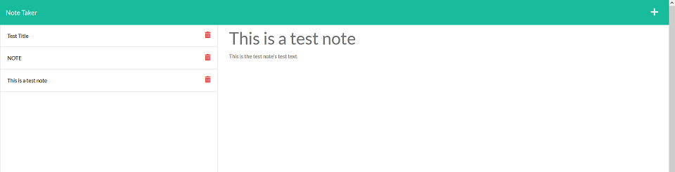

# Express Note Taker
---

## Description

This project links a pre-existing front-end with express inplementation to let a basic note-taking website save user input input through GET and POST http requests.

## Screenshots

Video Demo: https://watch.screencastify.com/v/5VnhpeUiyNGQN4Pz6gxR

## Installation

The app is deployed and usable entirely through Heroku at https://evening-beyond-33767.herokuapp.com/.

To host it locally, use node.js to install express and run using "npm run start" (or "npm run dev", if you prefer nodemon's live updating.)

## Github

https://github.com/shanep42/stunning-octo-lamp